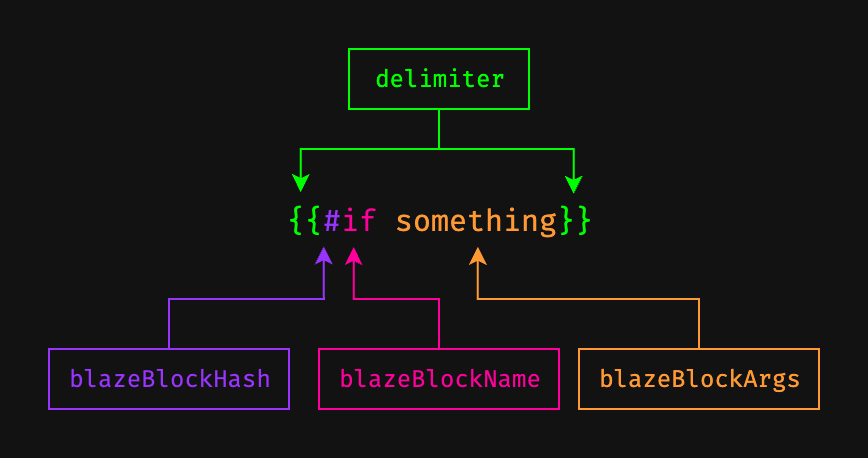

# Meteor/Blaze HTML Language Server

[](https://github.com/ptbarnum4/meteor-blaze-vscode-language-server/actions/workflows/ci.yml)

> **⚠️ Early Release Notice**: This is a new extension under active development. While functional, it may contain bugs or incomplete features. Please [report any issues](https://github.com/ptbarnum4/meteor-blaze-vscode-language-server/issues) you encounter to help improve the extension. Contributions and feedback are greatly appreciated!

A VS Code extension that provides intelligent language support for Meteor/Blaze templates within HTML files. Automatically detects Meteor templates and provides syntax highlighting, code completion, hover information, go-to-definition, and cross-file analysis.

## ✨ Key Features

- **🎯 Smart Template Detection** - Automatically activates for HTML files containing `<template name="...">` tags
- **🎨 Syntax Highlighting** - Full Blaze templating syntax support (`{{helper}}`, `{{#if}}`, etc.)
- **💡 Intelligent Code Completion** - Template helpers, CSS classes, built-in Blaze helpers, and template inclusions
- **✨ Auto-Insert End Tags** - Automatically completes Blaze block tags (`{{#if}}` → `{{/if}}`)
- **🔍 Cross-file Intelligence** - Analyzes neighboring TypeScript/JavaScript and CSS files for completions
- **📋 Rich Hover Information** - Shows helper definitions, file locations, and documentation
- **🎯 Go-to-Definition** - Navigate from helper usage to definition
- **🚨 Block Validation** - Detects missing or mismatched Blaze block end tags

## 🚀 Quick Start

### Installation

1. **From VS Code Marketplace**: Search for "Meteor/Blaze HTML Language Server" in VS Code Extensions
2. **Manual Installation**: Download the [latest .vsix file](https://github.com/ptbarnum4/meteor-blaze-vscode-language-server/releases) and install via "Extensions: Install from VSIX..."

### Usage

1. **Open an HTML file** containing Meteor templates:

   ```html
   <template name="myTemplate">
     <div>{{helper}}</div>
   </template>
   ```

2. **Add template helpers** in the same directory:

   ```javascript
   Template.myTemplate.helpers({
     helper: () => 'Hello, Meteor!'
   });
   ```

3. **Start coding!** Enjoy syntax highlighting, auto-completion, and intelligent features.

## ⚙️ Configuration

> [!NOTE]
> Extensions cannot set the `editor.semanticTokenColorCustomizations` setting programmatically due to VS Code limitations. Users must manually add these configuration to their settings.json to enable preferred semantic token color customizations. We encourage you to include the following for the best experience:

Basic configuration in VS Code settings:

```json
{
  // Basic language server settings
  "meteorLanguageServer.maxNumberOfProblems": 100,
  "meteorLanguageServer.trace.server": "off",

  // Block condition decoration overrides - distinctly different from defaults
  "editor.semanticTokenColorCustomizations": {
    "rules": {
      "blazeBlockHash": { "foreground": "#808080", "fontStyle": "bold" },
      "blazeBlockName": { "foreground": "#f177ff", "fontStyle": "italic bold" },
      "blazeBlockArgs": { "foreground": "#fffec4", "fontStyle": "bold" },
      "blazeBlockFirstArg": { "foreground": "#ffd16f", "fontStyle": "bold" },
      "blazeBlockSingleArg": { "foreground": "#ffd16f", "fontStyle": "bold" },
      "blazeExpression": { "foreground": "#ffd16f" },
      "blazeBlockIn": { "foreground": "#00ffa2", "fontStyle": "italic bold" },
      "delimiter": { "foreground": "#808080", "fontStyle": "bold" }
    }
  },
  "meteorLanguageServer.blockConditions": {
    "extend": [
      {
        "type": "mrkdwn",
        "label": "Custom Markdown Block",
        "propNames": ["text", "markdown", "content"],
        "requiresEndTag": true,
        "autoInsertEndTag": true
      }
    ],
    "margin": "0 0 0 0.75em",
    "fontStyle": "italic",
    "color": "#727272"
  },

  "meteorLanguageServer.blazeHelpers": {
    "extend": [
      {
        "name": "#mrkdwn",
        "doc": "Custom markdown block"
      }
    ]
  },

}
```

### Configuration Visuals




📖 **For complete configuration options and advanced features, see [docs/SETUP.md](./docs/SETUP.md)**

## 📚 Documentation

- **[📖 Complete Documentation](./docs/README.md)** - All documentation in one place
- **[⚙️ Configuration Guide](./docs/SETUP.md)** - Detailed configuration options
- **[🛠️ Development Guide](./docs/development/DEVELOPMENT.md)** - Contributing and development setup
- **[✨ Feature Documentation](./docs/FEATURES.md)** - Detailed feature explanations
- **[📝 Changelog](./docs/CHANGELOG.md)** - Version history

## 🆘 Need Help?

- **[🐛 Report Issues](https://github.com/ptbarnum4/meteor-blaze-vscode-language-server/issues)** - Bug reports and feature requests
- **[🔧 Troubleshooting](./docs/SETUP.md#troubleshooting)** - Common issues and solutions
- **[� Development](./docs/development/DEVELOPMENT.md)** - Contributing to the project

## 📄 License

MIT License - see [LICENSE](./LICENSE) file for details.

---

**Made with ❤️ for the Meteor.js community**
